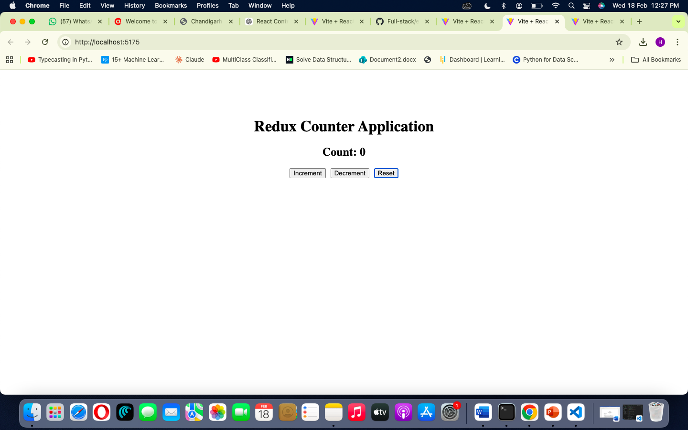
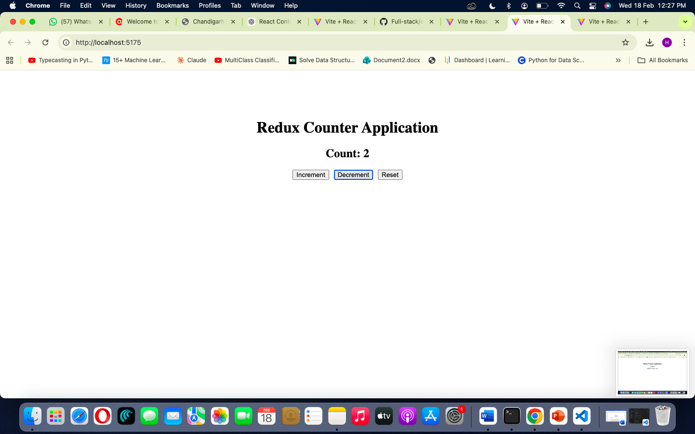
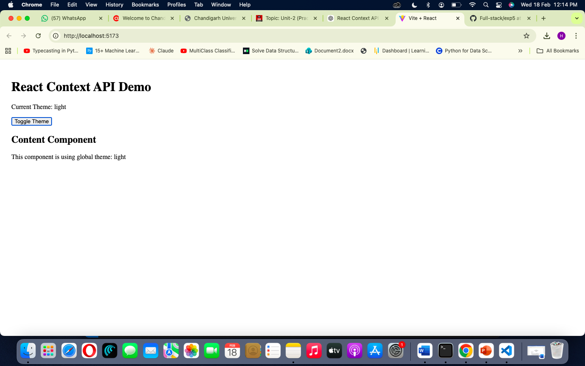
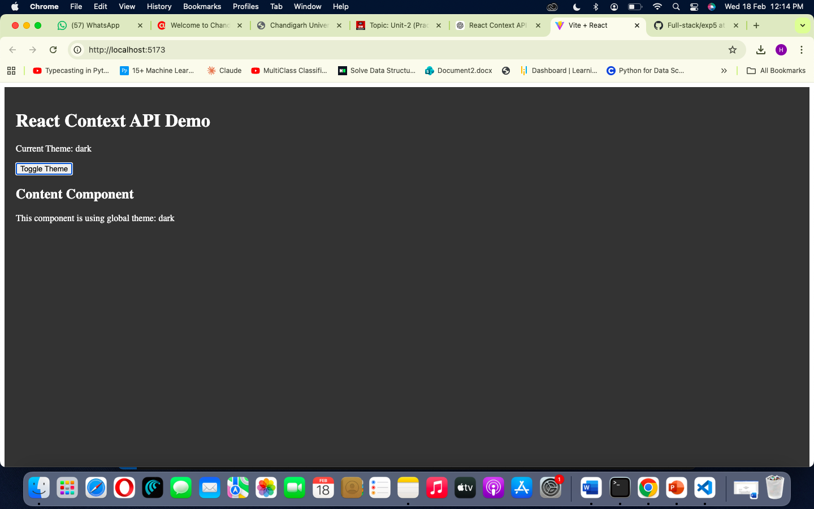
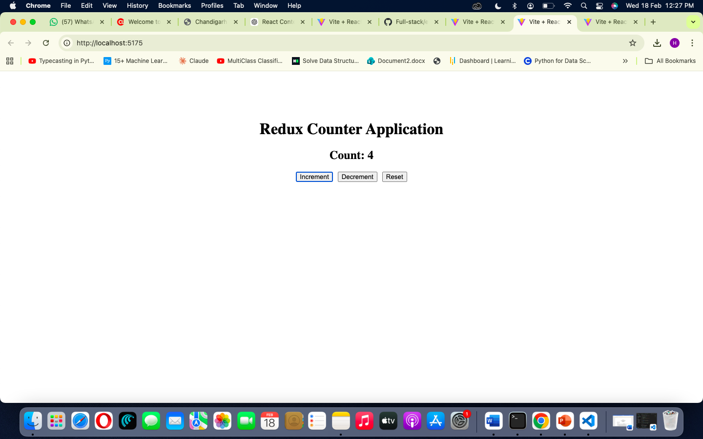

# Experiment 4  
## State Management in React  
### 1️⃣ Global State Management using Context API  
Folder: `globalsm/`

### 2️⃣ State Management using Redux  
Folder: `reduxsm/`

---

# 📸 Screenshots

## Screenshot 1 - Context API Output

## Screenshot 2 - Context Toggle

## Screenshot 3 - Redux Counter Initial

## Screenshot 4 - Redux Increment

## Screenshot 5 - Redux Decrement

